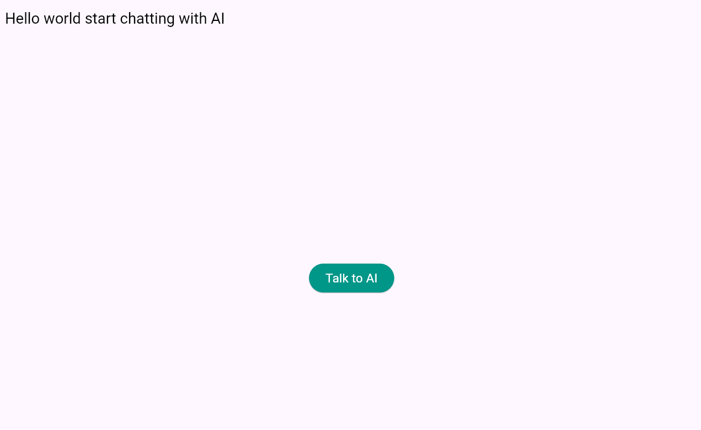
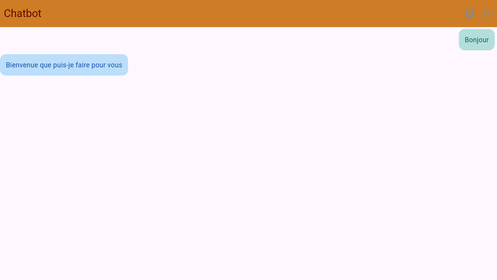
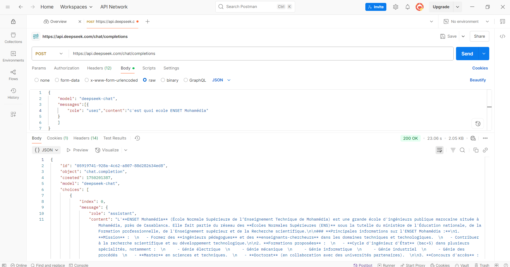
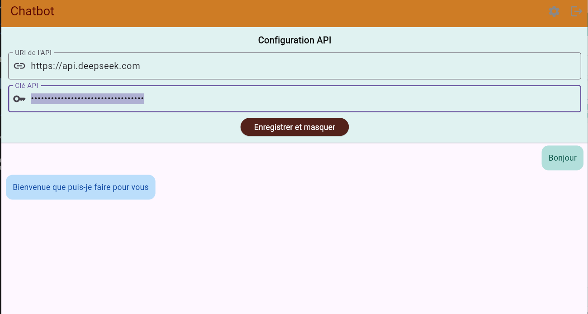
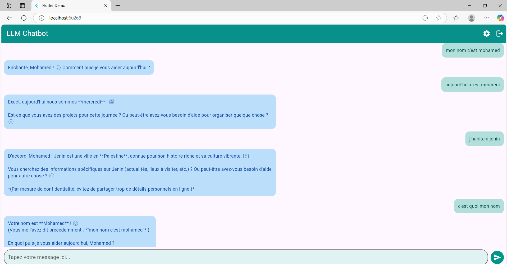

# deepseek_chatbot_app

Chatbot App builded, based on AI LLM

## Getting Started

# Page d'accueil

# Page du LLM

# Premier test avec PostMan

# Formulaire de configuration

# Tests effectués sur le LLM

Objectif :

Développer une application mobile cross platform avec Flutter qui permet de créer un Chatbot qui interagit avec les LLMs tels que OpenAI GPT ou LIAMMA
L'application se compose de deux écrans :
- Ecran d'authentification qui permet de saisir le username et le mot de passe
- Ecran de chat avec un LLM
  Voir la vidéo : https://youtu.be/DXikiU6EdZE